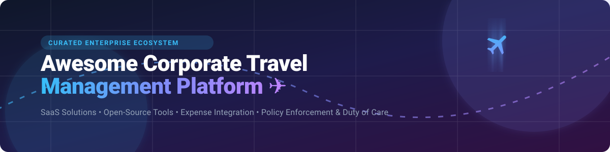

# ✈️ Awesome Corporate Travel Management Platform

  

  
  
  
  
  
  

## 🌟 Top Corporate Travel Management Platforms & Software Ecosystem

> **Curated List of Enterprise SaaS Products, Open-Source GitHub Projects & Travel Technology Solutions**  
> *Focused on Managed Business Travel, Expense Integration, Travel Policy Enforcement, Risk Management & Duty of Care.*

*Last updated: September 2026*

---

## 📌 Overview & SEO Summary

Welcome to the ultimate directory for **Corporate Travel Management (CTM)** software! Whether you are a corporate travel manager, CFO, HR administrator, or software engineer building travel technology, this list provides a transparent comparison of market-leading enterprise SaaS platforms and self-hosted open-source software.

Key travel management features covered:
- 🛫 **Corporate Booking Tools (CBT)** & GDS/NDC integrations
- 💳 **Expense & Corporate Card Integrations** (SAP Concur, Navan, TravelBank)
- 📋 **Automated Travel Policy Enforcement** & Multi-Level Approval Workflows
- 🛡️ **Duty of Care & Traveler Safety** tracking
- 🤖 **AI-Powered Travel Assistants & MCP (Model Context Protocol) Integration**

---

## 📑 Table of Contents
- [🏢 Market Overview](#-market-overview)
- [💼 SaaS / Hosted Platforms](#-saas--hosted-platforms)
- [🔓 Open-Source GitHub Projects](#-open-source-github-projects)
- [🤝 How to Contribute](#-how-to-contribute)
- [💖 Support & Sponsorship](#-support--sponsorship)
- [📈 Star History](#-star-history)
- [⚠️ Disclaimer](#-disclaimer)

---

## 🏢 Market Overview

> 📊 **Estimated Market Size**: The global Corporate Travel Management market is estimated at **$1.3 Trillion to $1.5 Trillion**, with corporate travel management software and SaaS technology accounting for over **$12 Billion** and growing at ~10% CAGR.  
> 🏆 **Market Structure**: The sector is **moderately fragmented**, featuring legacy enterprise giants (SAP Concur, Amex GBT), fast-growing venture-backed unicorns (Navan, TravelPerk, Spotnana), and regional Travel Management Companies (TMCs), alongside specialized open-source building blocks.

---

## 💼 SaaS / Hosted Platforms

Below is a curated comparison of leading commercial corporate travel and expense platforms, sorted by **Valuation / Company Size (Descending)**:

| Platform | Description & Key Strengths | Enterprise Size / Valuation | Starting Pricing Tier | Free Tier / Trial Limits |
| :--- | :--- | :--- | :--- | :--- |
| **[SAP Concur Travel](https://www.concur.com/)** 🏢 | Enterprise travel and expense management suite providing deep ERP integration, automated booking, and compliance tracking. | **~$160B** *(Parent SAP Market Cap; ~50% market share)* | Custom starting volume tiered pricing (~$8–$12 per expense/booking transaction) | No free tier; 14-day requestable guided enterprise demo |
| **[Egencia](https://www.egencia.com/)** 🌍 | Global business travel platform by American Express Global Business Travel (Amex GBT) offering digital booking & 24/7 travel agent support. | **~$3.2B** *(Amex GBT Market Cap; Subsidiary)* | ~$8 – $25 per booking transaction + platform fee | No free tier; custom enterprise demo upon request |
| **[TravelPerk](https://www.travelperk.com/)** 🚀 | Modern business travel platform featuring FlexiPerk for flexible trip cancellations and unified invoicing. | **~$2.7B** *(Valuation)* | Starter plan at $0/mo + booking fees; Premium from $99/mo | Permanent Free Starter Plan (up to 5 bookings/month) |
| **[Navan](https://navan.com/)** 💳 | All-in-one corporate travel, corporate card, and expense management platform with AI-driven booking algorithms. | **~$2.5B+** *(Valuation)* | Travel platform free for ≤300 employees; Expense at $15/active user/mo | Permanent Free Business Plan for travel (up to 300 employees; 5 free expense users) |
| **[Spotnana](https://www.spotnana.com/)** ⚡ | API-first Travel-as-a-Service (TaaS) platform powering modern TMCs, enterprise travel portals, and tech partners. | **~$1.2B** *(Valuation)* | Flat per-trip booking fee model (Custom enterprise quoting) | No free tier; sandbox developer access & demo on request |
| **[CTM (Corporate Travel Management)](https://www.travelctm.com/)** 🌏 | Global corporate travel management company offering proprietary Lightning booking tech and traveler duty of care tracking. | **~$250M** *(Market Cap ASX: CTD)* | Custom management fee or transaction fee structure | No free tier; demo available upon consultation |
| **[AmTrav](https://www.amtrav.com/)** 🧳 | All-in-one business travel booking and reporting platform with 24/7 in-house travel advisor support. | *Acquired by TravelPerk (2024)* | Flexible per-trip booking fee or monthly management tier | 30-day trial available for mid-market teams |
| **[TravelBank](https://www.travelbank.com/)** 🏦 | All-in-one expense and business travel management system featuring employee travel rewards. | *Subsidiary of U.S. Bank* | Custom per-user or per-transaction plans starting ~$25/user/mo | No free tier; 30-day trial for select expense plans |

---

## 🔓 Open-Source GitHub Projects

This section lists open-source trip planning software, expense trackers, and approval workflows. 

> 💡 **Open-Source Reality Check**: No single production-ready open-source system provides full GDS/NDC corporate booking engines out of the box. However, combining the top repos below offers a complete self-hosted foundation for itinerary management, expenses, and approvals!

Projects are sorted by **GitHub Stars (Descending)** with direct links to stargazers:

### 🛠️ Open-Source Projects Table

| Project | Description | Stars Badge | License | Tech Stack |
| :--- | :--- | :--- | :--- | :--- |
| **[TREK](https://github.com/liketrek/TREK)** | Mature self-hosted travel planner with drag-and-drop itineraries, budget tracking, real-time collaboration, and Model Context Protocol (MCP) AI integration. |  | AGPL-3.0 | Docker, Node.js, Leaflet, PWA |
| **[AdventureLog](https://github.com/seanmorley15/AdventureLog)** | Self-hostable travel tracker and trip planner. Enables multi-day itinerary building, place logging, and interactive world maps. |  | GPL-3.0 | Vue, Node.js, Maps |
| **[trip](https://github.com/itskovacs/trip)** | Minimalist, privacy-focused self-hosted POI (Point of Interest) map tracker and travel itinerary planner. |  | MIT | Go, Mapbox, Svelte |
| **[pockaw](https://github.com/layground/pockaw)** | Open-source expense & budget tracker designed to record transaction history, budget limits, and financial analytics. |  | MIT | React, Node.js |
| **[budget-tracker](https://github.com/sammitjain/budget-tracker)** | Lightweight offline-first expense tracking application utilizing local storage for corporate expense logging. |  | MIT | React Native, WatermelonDB |
| **[MooNsPlanner](https://github.com/schowdary75/MooNsPlanner)** | Self-hosted travel planning platform with flight tracking, NestJS backend, MariaDB/SQLite, and Helm charts for Kubernetes. |  | MIT | React 19, NestJS, Docker |
| **[ExcursioX](https://github.com/moizkamran/ExcursioX)** | Open-source Travel CRM and agency management web system with booking management, ticketing, and customer tracking. |  | MIT | MERN Stack (MongoDB, Express, React, Node) |
| **[TripFlow](https://github.com/JavaChrist/TropFlow)** | Modern business travel expense management web app with destination tracking, PDF invoice processing, and Resend email alerts. |  | MIT | React 18, TypeScript, Tailwind, Firebase |
| **[aspl_hr_travel_management](https://apps.odoo.com/apps/modules/18.0/aspl_hr_travel_management)** | Odoo module for enterprise employee travel requests, multi-currency expenses, grade-based allowance rules, and HR approvals. |  | LGPL-3 | Python, Odoo ERP |
| **[TurboOA](https://github.com/yangqian2024/TurboOA)** | Enterprise approval workflow system built on WeChat Mini Program, ideal for mobile corporate travel requests and expense approvals. |  | Apache-2.0 | WeChat Mini Program, Serverless |
| **[Travel-Approval-Lightning-App](https://github.com/Mr-Techganesh/Travel-Approval-Lightning-App)** | Salesforce platform application for corporate travel approval processes, destination validation, and expense roll-up calculations. |  | MIT | Salesforce Lightning, Flow Builder |

---

## 🤝 How to Contribute

Contributions are welcome! Help us keep this corporate travel ecosystem up-to-date:

1. 🍴 **Fork** this repository.
2. 📝 Add or update entries in `README.md` following the tabular format.
3. 🔍 Provide factual descriptions, starting pricing tiers, and official website links.
4. 🚀 Submit a **Pull Request (PR)** with a clear title and summary.

---

## 💖 Support & Sponsorship

If you find this repository helpful for your travel technology research or corporate software evaluation, please consider supporting the project!

- ⭐ **Star** this repository on GitHub
- 🍴 **Fork** it to share with your team
- 📢 **Share** it on LinkedIn, X/Twitter, or Reddit
- ☕ **Buy Me a Coffee / Sponsor**: Support ongoing maintenance via [GitHub Sponsors](https://github.com/sponsors/ishandutta2007)

---

## 📈 Star History

---

## ⚠️ Disclaimer

- This is a **community-curated** list for informational and educational purposes — not an endorsement or formal warranty.
- Corporate travel software processes sensitive employee and financial data; ensure compliance with GDPR, SOC 2, Duty of Care, and corporate governance standards.
- Pricing, valuations, and features are based on public disclosures as of September 2026 and are subject to change by respective vendors.

---

  <b>Made with ❤️ for corporate travel managers, finance teams, HR leaders, and travel software engineers worldwide.</b>

